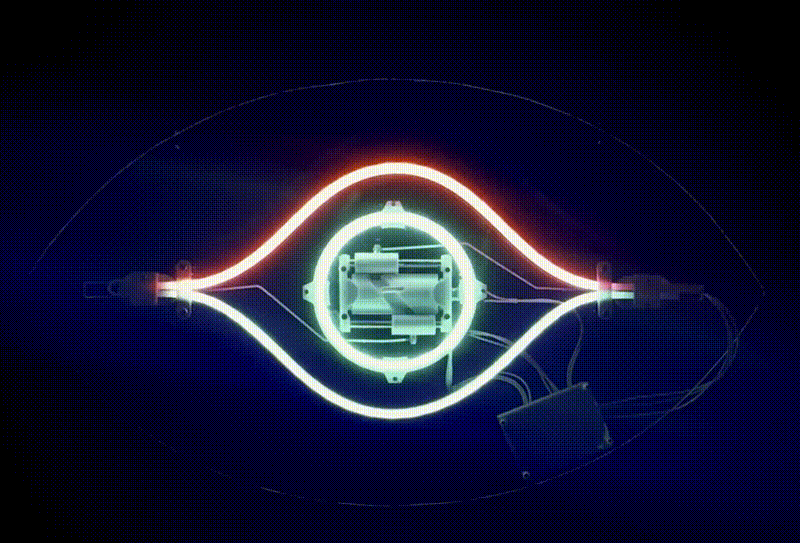

<div align="center">
  
</div>


This is my kinetic faux-neon animated eyeball. You can [read about it here](http://localhost:1313/neon-animated-eye/).


## Setup

1. Clone the TB6612 driver into the project root:
   ```
   cd kinetic_eye
   git clone https://github.com/igorSouzaA/esp32-tb6612fng
   ```
   The project root should look like:
   ```
   kinetic_eye/
     CMakeLists.txt
     sdkconfig.defaults
     main/
       main.c
       motor_task.cpp   ← C++ because TB6612 library is C++
       hall_task.c
       led_task.c
       anim_task.c
       *.h
     esp32-tb6612fng/   ← cloned here
       TB6612FNG/
         CMakeLists.txt
         include/TB6612FNG.hpp
         src/TB6612FNG.cpp
```

2. Set target and build:
   ```
   idf.py set-target esp32c3
   idf.py build
   idf.py flash monitor
   ```

## Wiring

| Signal   | GPIO |
|----------|------|
| AIN1     | 8    |
| AIN2     | 9    |
| PWMA     | 10   |
| STBY     | PCB pullup (GPIO3 driven high in software as backup) |
| Hall ADC | 1    |
| Eyelid   | 20   |
| Eyeball  | 21   |

## Tuning

All tuneable values are in `main/eye_config.h` inside `EYE_CONFIG_DEFAULT`:

| Parameter | Default | Description |
|-----------|---------|-------------|
| `motor_speed_homing` | 80 | Motor PWM (0-255) during homing |
| `motor_speed_run` | 180 | Motor PWM during blink |
| `homing_peak_hysteresis` | 0.05 | How far Hall must drop past peak before homing locks (fraction of ADC range) |
| `estimated_cycle_ms` | 600 | First-guess revolution period — self-corrects after first blink |
| `blink_pause_min_ms` | 10000 | Minimum idle time between blinks |
| `blink_pause_max_ms` | 60000 | Maximum idle time between blinks |
| `occlusion_start_phase` | 0.35 | Phase at which eyeball starts dimming |
| `occlusion_end_phase` | 0.85 | Phase at which eyeball is fully dark |
| `flame_probability` | 0.10 | Chance of flame effect per blink (0.0–1.0) |

## Notes

- GPIO3 is used as the software-driven STBY pin backup. Change `MOTOR_PIN_STBY`
  in `motor_task.cpp` if GPIO3 conflicts with anything on your board.
- The TB6612 STBY pin is already pulled high on the PCB; the GPIO3 drive is
  belt-and-suspenders and can be removed if it causes issues.
